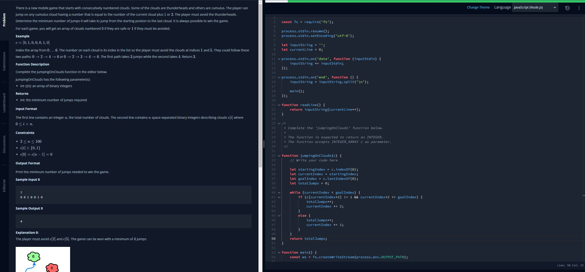

# Hacker Rank Warmup Challenges

## Sock Pair Count from given a number and array with indexes for each sock

## Valley count given number of steps and if step is up and down from a string of characters

## Min Jump Count given array with allowed or avoid clouds, and if the jumps can be + 1 or + 2 indexes in the array

