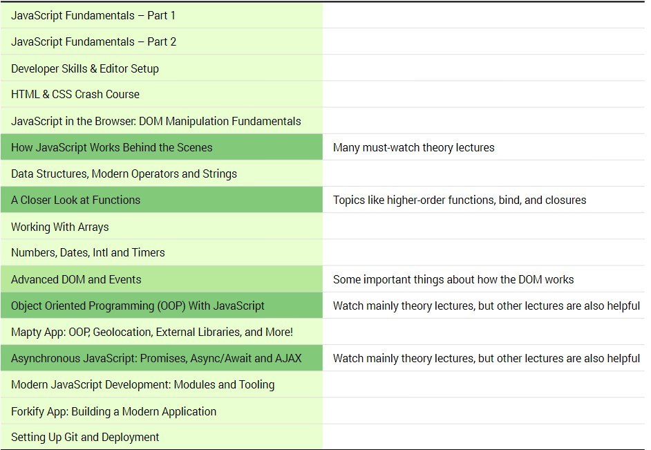

# Job Interview Prep Pathway

---

The following image dictates the courses and pathways required to learn the required information most likely for interview prep. Will also be going through information I deem required/important



---

## How Javascript works behind the scenes

### Overview of JS BTS

## Data Structures, Modern Operators and Strings

### Destructuring Arrays

- Way to unpack values from an array or an object into separate variables
- Able to essentially auto assign array variables to a separate set of variables through singular line of code

```
const arr = [1, 2, 3];

const [x, y, z] = arr;
```

- Doing so like above, we can easily now assign x y and z to the respective values in the array in the same order without needed to assign each value manually
- Note that the second const is not an array, it is just a destructred syntax
- Essentially grabbing values as if it's from an object, and can grab only just the variables we want
- Note to grab a variable that is at different location, we can leave a gap and not grab all items in that order for e.g.

```
const arr = [1, 2, 3, 4];

const [x, , y, z] = arr;
// x = 1, y = 3, z = 4

```

- Can easily use this destructuring to swap variables values for e.g.

```
const arr = [1, 2];
const [x, y] = arr;

// x = 1, y = 2

// Perform destructuring reassignment
[x, y] = [y, x];

// x = 2, y = 1
```

- Destructuring useful as we can receive two return values from one piece of function or code. For e.g.
  - Check the codesample for starter, how to return two values through one function section

```
const restaurant = {
  name: 'Classico Italiano',
  location: 'Via Angelo Tavanti 23, Firenze, Italy',
  categories: ['Italian', 'Pizzeria', 'Vegetarian', 'Organic'],
  starterMenu: ['Focaccia', 'Bruschetta', 'Garlic Bread', 'Caprese Salad'],
  mainMenu: ['Pizza', 'Pasta', 'Risotto'],

  order: function (starterIndex, mainIndex) {
    return [this.starterMenu[starterIndex], this.mainMenu[mainIndex]];
  },

}
```

- Can also destructure for nested arrays, same concept as standard destructuring for e.g.

```
const arr = [1, 2, [3, 4]];
const [x, , [y, z] = arr;

// x = 1, y = 3, z = 4
```

- Can set the destructuring array to have default values for each assigned variable to account for arrays with unknown size

### Destructuring Objects

- As expected, destructuring of object means that we can automatically assign data received from external api or other area, and immediately assign and choose the exact object values we want, by purely naming the destructured variable we are assigning the same as the objects key value
  - Check code in script.js under destructuring objects
- Can rename each of the variables to be destructured from object so they are not same as object names if we like
  - Check code under Destructuring with different names
- Set default value with assignment of a value during the destructuring writing

  - Check code called default value

- Can mutate variables with a replacement object if we wrap it all in parentheses

  - Check code under mutating variables from object

- This destructuring can also be done automatically for functions input params
  - Note that the input param must be inserted as an object to be recognised correctly for destructuring
  - Check sample application for obj destructuring code

### Spread Operator

- Spread array is the `...` symbol before a parameter that we usually want to access, which allows us to immediately pass in an iterable or a array without requiring to add each of the elements inside it again manually
- Useful for brining over predefined arrays or values into a new array
- For arrays, if we dont use the spread operator, it will nest the array inside the new array, rather than 'spread' it's values
- Can also use the spread value to expand arrays when logging or passing them to any other form

- Can only use the spread operator at places we would use separators with commas
- Similar to destructuring essentially

  - Check code for Sample of creating new array with a existing array, as well as copying an array and joining two arrays

- Can spread other iterables such as strings, sets, maps and arrays

  - Check code for samples

- Useful to use to immediately pass in an iterable and cycle through all values inside, without needing to individually pass/call each respective value for a function to recognise the input params
- Also now works on objects

### Rest Pattern

- Opposite to the spread operator whereby it will pack elements into an array rather than spread them out of an array
- To be able to discern between spread and rest, it depends on the placement of the dots:

  - If the three dots used are on the RIGHT of equal sign = spread
  - If the three dots used are on the LEFT of equal sign = rest

- Will essentially pack the remainder of vales in array usuall into a new array dictated to be defined by the rest patter, check the codebase for sample
- Note: Rest must only be used once in any assignment and only at the end of all the assignments

- MAIN USE CASE OF REST PATTERN:

  - To help pass in arbitrary number of variables into a function
  - While the spread pattern allowed for a return of multiple values, a rest pattern allows entry of multiple values as input parameters
  - Check functions section of Samples for Rest Operator\
  - Note input is usually array elements

- Usually if method requires, we would write it so it just accepts array
- However through usage of spread nad rest, we can now have arbitrary no. of values passed in, create more robust and dynamic code

- Sample functions:
  - Can be used to separate specific variables being inputted for usage in certain data or functionality
  - Can be used to dynamically perform actions on an unknown number of variables

## Closer look at functions

## Working with Arrays

## Advanced DOM and Events

## Object Oriented Programming

## Async Javascript - Promises, Async/Await and AJAX
